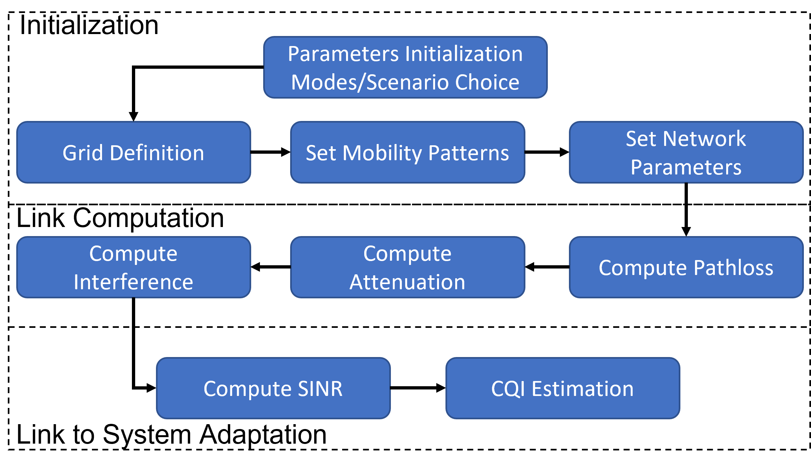
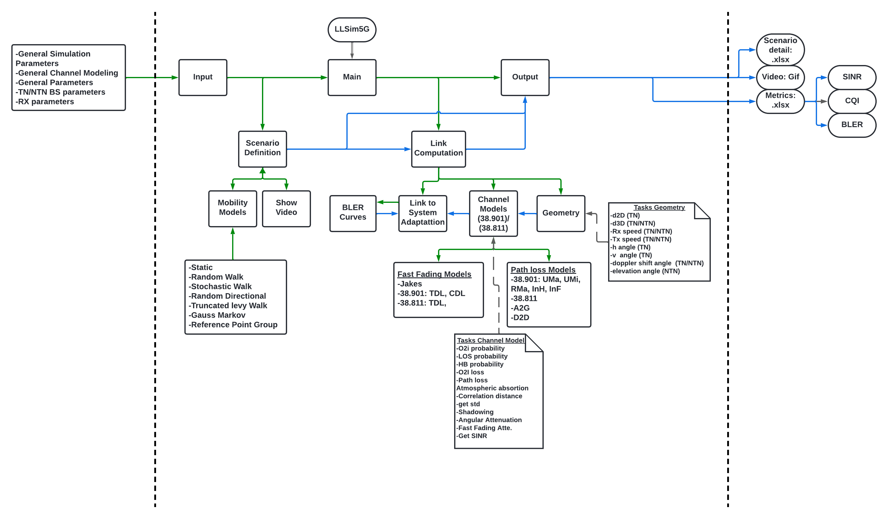

# LLSim5G

<div style="text-align: justify;">

If you are looking to implement personalized link-level simulations of a heterogeneous 5G network and assess the
performance of your proposed algorithms, this could be a solution, facilitating your upcoming research activities. 
The LLSim5G is an open-source link-level simulator (LLS) developed in Python to recreate heterogeneous 5G use cases.
The rationale behind this proposal is to tailor a controlled simulated environment where it could coexist
terrestrial networks (TNs) and non-terrestrial networks (NTNs) with multiple concurrent users under diverse mobility behaviors
and reception conditions, requesting differentiated broadband traffic from the available infrastructure.

The implemented link channel models for TN and NTN comply with the 3GPP standards TR 38.901 [REF] and TR 38.811 [REF],
respectively, for frequencies from 0.5 to 100 GHz. For the NTN use cases, it could be simulated the satellite service links
from spaceborne or airborne platforms to multiple handheld or IoT end devices. Regarding TN, the LLSim5G allows recreating 
all the scenarios defined in TR 38.901, such as Urban Macro (UMa), Urban Micro (UMi), Rural Macro (RMa), Indoor-Hotspot
(InH) and Indoor-Factory (InF). Moreover, we add the capability of simulating unmanned aerial vehicles (UAVs) acting as
5G base stations (BSs) following the Urban Aerial-to-Ground (UAG) channel model as described in [REF]. In any case, the 
simulated use case could be a complex three-dimensional (3D) heterogeneous network (HetNet) with multiple TNs, NTNs, and 
UAVs covering the desired service area.

Regarding the end devices (EDs), their configuration for the link computation is compliant with the 3GPP standards 
TR 38.901 [REF] and TR 38.811 [REF], and subject to the considered network. The resulting link computation could be 
subject to (s.t.), if enabled, fast-fading (FF), shadowing fading (SF), atmospheric absorption (AA), line-of-sight (LOS)
or non-line-of-sight (NLOS), outdoor-to-indoor (O2I) penetration, and human blockage (HB). In the simulation, we can
define multiple (only constrained for the resulting simulation time) EDs freely distributed in the service area, with
either static or complex mobility behaviors (as described below) and different velocities. Among the EDs, we add the capability
of bidirectional link computation through device-to-device (D2D) communication (if enabled) with multiple applications
such as D2D multicasting (D2DM), forwarding device (FD) selection, or vehicle-to-vehicle (V2V) communication.

The physical (PHY) link layer of a wireless communication system is typically simulated through LLSs, mathematically 
modeling the point-to-point communication of a paired transmitter (Tx) and receiver (Rx) with a detailed link characterization
and evaluating metrics such as bit/block error rate (BER/BLER) and signal-to-interference-plus-noise ratio (SINR) (typically
used as reference inputs to system-level simulators (SLS)) [6]. Multiple research fields take advantage of LLSs for
advancing fields such as radio resource management, interference management, channel estimation, Multiple-Input
Multiple-Output (MIMO) and Adaptive Modulation and Coding (AMC) scheme. In such context, the initial version of the
LLSsim5G could be a useful tool for addressing various open research challenges. 

## Table of Contents

- [Main Features](#installation)
- [Structure](##contributing)
- [Installation/Requirements](#contributing)
- [How to use](#contributing)
- [Contributing](#contributing)
- [License and Citation](#acknowledgements)
- [Acknowledgements](#acknowledgements)
- [References](#acknowledgements)


## Main Characteristics

Table I summarizes the main LLSim5G characteristics for this initial version (v.1.0.0).

Table I. LLSim5G main parameters.

| Parameters                  | Value (v.1.0.0)                                                                                                          |
|-----------------------------|--------------------------------------------------------------------------------------------------------------------------|
| Scenarios                   | TN: UMa, UMi, RMa, InH, InF, <br/> NTN: HAPS, LEO, MEO, GEO,<br/>UAV: A2G                                                |
| Link Modes                  | TN/UAV: downlink (DL), uplink (UL), <br/> NTN: DL<br/>  D2D                                                              |
| Network Topology            | Single Cell or Multicell                                                                                                 |
| EDs type                    | pedestrian, vehicle, IoT                                                                                                 |
| Frequency range (GHz)       | 0.5-100                                                                                                                  |
| NR numerology               | 0-4, s.t. 3GPP TS 38.214                                                                                                 |
| Path Loss models            | TN/D2D: TR 38.901,<br/> NTN: TR 38.811,<br/>A2G: [REF]                                                                   |
| Large scale fading models   | TN/D2D/UAV: TR 38.901,<br/> NTN: TR 38.811                                                                               |
| Fast fading models          | TN/D2D/UAV: TDL, CDL (s.t. TR 38.901), Jakes (s.t. [REF]),<br/> NTN: TDL (s.t. TR 38.811), Jakes (s.t. [REF])            |
| Propagation conditions      | O2O (LOS/NLOS), O2I (NLOS), I2I (LOS/NLOS)                                                                               |
| Link to system Adaptation   | BLER and CQI estimation                                                                                                  |
| Atmospheric Absorption      | yes, TN/A2G: TR 38.901,<br/> NTN: TR 38.811                                                                              |
| Antenna Model               | TN/UAV/D2D: s.t. TR 38.901 (Omnidirectional, Three sectors (120°), Four sectors (90°))  <br/> NTN: s.t. TR 38.811        |
| Antenna Polarization        | single, dual                                                                                                             |
| EDs mobility models         | Stationary,  Linear, Random Walk, Random Waypoint,<br/>Random Direction, Truncated Levy Walk, Gauss-Markov, Gauss-Markov |            
| NTN and UAV mobility        | Not available in this current version                                                                                    |
| MIMO                        | Not available in this current version                                                                                    |
| Interference considerations | Not available in this current version                                                                                    |
| Outputs                     | BLER, SINR, CQI, nodes coordinates, speed, Grid, and nodes movement video                                                |

## Structure

Our open-source LLS is wholly programmed in Python language with a modular structure and flow process, according to
Fig. 1. The first step is the initialization of the parameters and simulation settings, such as simulation time,
resolution, grid size, type and the number of users, mobility models, the number of TNs, NTNs, and UAVs covering the desired service
area, among multiple others, as defined in [SimulationConfiguration](./SimulationConfiguration.pdf). Once the 
simulator’s initialization and resource pool selection are finalized, it starts the iterative link computation
along the defined simulation time. The links are computed among all the available BSs and EDs and subject to the selected
link modes, s.t. Table I. In the case of D2D, the simulator calculates the D2D link among all the EDs (with the D2D mode
enabled) independently of their distance. The link computation ends with the resulting SINR for each enabled link. Then,
the link to system abstraction is executed, where each SINR value is estimated for the BLER and the corresponding CQI.




Fig. 1: LLSim5G abstraction model. 

[//]: # (![LLSim5G abstraction model]&#40;general/img/SchemeFlow.png&#41;)
[//]: # (Fig. 1: LLSim5G abstraction model )

Fig. 2 presents the internal structure of the simulator, including the dependencies of the .py files, as well as the inputs and 
outputs. The details about the overall outputs of the simulator can be found in [SimulationOutputs](./SimulationOutputs.pdf).



Fig. 2: LLSim5G internal structure.

[//]: # (![LLSim5G internal structure]&#40;general/img/LLSim5g_IStructure.png&#41;)
[//]: # (Fig. 1: LLSim5G internal structure)


## Installation and Requirements

You need to clone the project from GitHub using the link: https://github.com/EFontesP90/lls_tn-ntn_5g.git;
or download the project ZIP file.
Then, you need to check that all the requirements, main dependencies, and external libraries and versions are satisfied 
([requirements](./requirements.txt)).

## How to use

First, you need to carefully check the [SimulationConfiguration](./SimulationConfiguration.pdf) and 
[SimulationOutputs](./SimulationOutputs.pdf) files and the additional complementary documents.

## Contributing

## License and Citation

## Acknowledge

## References

------------------------------------
----------------------------------


Instructions on how to install your project. For example:

```bash
pip install your_project_name
```

## Instructions on how to use your project.

```bash
import your_project_name
```

# Example usage

```bash
your_project_name.some_function()
```

# Features
List of features your project provides.

# Core Contributors

Ernesto Fontes Pupo, orcid: "0000-0002-1715-6015", affiliation: "University of Cagliari", e-mail: efontesp90@gmail.com

Claudia Carballo Gonzalez, orcid: "0000-0002-6429-1375", affiliation: "University of Cagliari", e-mail: ccgclaudia7892@gmail.com

# Contributing

Guidelines on how to contribute to your project. For example:

-Fork the repository
-Create a new branch (git checkout -b feature/feature-name)
-Commit your changes (git commit -m 'Add some feature')
-Push to the branch (git push origin feature/feature-name)
-Open a Pull Request

## License

This project is licensed under the Apache License 2.0. For details, see the [LICENSE](./LICENSE) file.

## Acknowledgements

- Thanks to [Person](https://github.com/person) for their guidance.
- [Library](https://link-to-library) for providing useful resources.

---

*This project is a part of XYZ initiative and is maintained by [Your Name](https://github.com/your-github-profile).*

For any questions or issues, please contact [Your Email](mailto:your-email@example.com).

# Acknowledgements

Credits and acknowledgements for resources, libraries, inspiration, etc.

## References


G. T. 38.901, “5g; study on channel model for frequencies from 0.5 to 100 ghz (3gpp tr 38.901 version 16.1.0 release 16),” 2020.

G. Nardini, D. Sabella, G. Stea, P. Thakkar, A. Virdis, "Simu5G – An OMNeT++ Library for End-to-End Performance
Evaluation of 5G Networks," in IEEE Access, vol. 8, pp. 181176-181191, 2020, doi: 10.1109/ACCESS.2020.3028550.

[6] M. Rupp, S. Schwarz, and M. Taranetz, “The vienna lte-advanced simulators,” https://link. springer. com/book/10.1007% 2F978-981-10
0617-3, 2016.

[14] W. Khawaja, I. Guvenc, D. W. Matolak, U.-C. Fiebig, and N. Schneck enburger, “A survey of air-to-ground propagation channel modeling for
unmanned aerial vehicles,” IEEE Communications Surveys & Tutorials, vol. 21, no. 3, pp. 2361–2391, 2019.

“5g; NR; physical layer procedures for data,” 3GPP, Sophia Antipolis,
 France, 3GPP Rep. TS 38.214 version 16.2.0 release 16, 2020.

</div>
